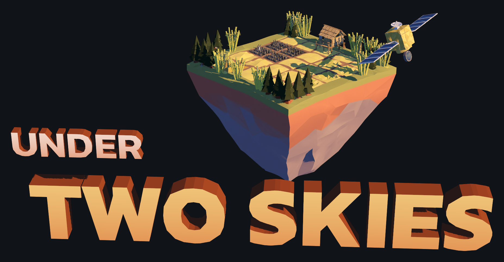
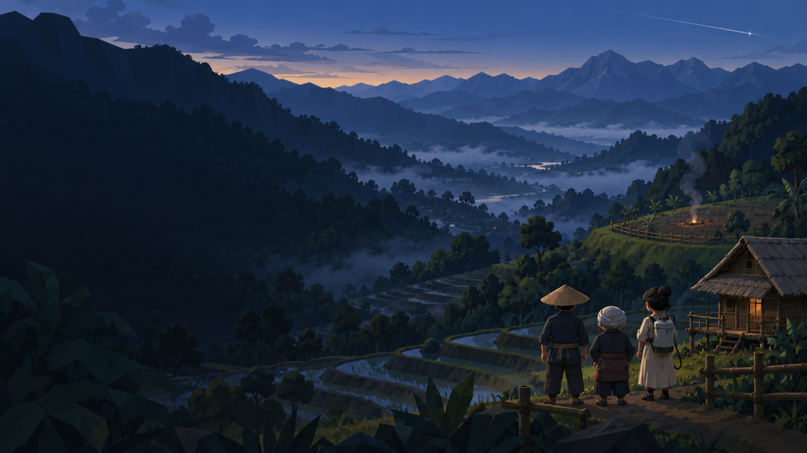

<p align="center"></p>

# Under Two Skies · ไร่หมุนเวียนใต้เงาดาวเทียม

*(formerly "Satellite Shadow" / เงาเมฆา)*



A low-poly tactical survival game about **ไร่หมุนเวียน (Rai Mun Wian)**,
the rotational upland farming of Pgakenyaw (Karen) communities in Northern
Thailand.

Each dry season, the fallow must be burned to ash so upland rice can grow
before the monsoon. A zero-burn decree is enforced by polar-orbiting
satellites. Between **14:00 and 20:00** they have a blind spot. In that window,
you and your crew (ขะแน, the elder ตาโพ and the young มูนอ) cut firebreaks,
burn the plot, and cool every ember before the **20:00 VIIRS pass**. Burn too
little and the village goes hungry. Leave a hotspot and the state comes.

The game supports **Thai and English** interface text, subtitles and recorded
speech. Choose the language in Settings. It is built with **Godot 4.7.2**.

> Status: free playtest beta. Beta 3 / 0.3.0 is being qualified;
> see [`release audit`](docs/RELEASE_BETA3.md) for exact build/publication status.

## Run it from source

1. Install [Godot 4.7.2](https://godotengine.org/download) (standard build, not .NET).
2. Clone this repo and open `project.godot` in Godot, or run:
   ```bash
   godot --path .
   ```
   The first launch imports assets, which takes a minute.

## Playtest builds

```bash
tools/build.sh            # macOS, Linux and Windows into a fresh build/<date-time>-<commit>-<run>/
tools/build.sh Linux      # one platform
```

These need Godot 4.7.2 export templates (Editor → Manage Export Templates).
Commit runtime source/assets before exporting. The build script rejects engine
errors and records its exact source revision. Exported macOS ZIPs are initially
ad-hoc signed; qualify the candidate, then run `tools/notarize_mac.sh <zip>`
with the existing Developer ID and `undertwoskies-notary` keychain profile.
Publish only the resulting notarized ZIP after Gatekeeper verification.
Windows is unsigned; native Windows and Steam Deck testing remain release limits.

Testers' play is logged to `playtest_log.csv` in the game's user folder
(Settings → เปิดโฟลเดอร์บันทึกการเล่น). Tester tools (F3 info, F5–F10 time skips
and forced events) can be switched on in Settings.

## How to play

The in-game **วิธีเล่น** card explains it fully. Each plot is judged at 20:00 on two goals:

1. **Ash:** at least 75% of the plot burned and cooled to ash. That fills the rice barn.
2. **Heat:** **no glowing embers** left for the satellite to see.

Fire lit after about 17:16 won't cool by itself in time, so you'll have to spray
it. Fuel is damp at 14:00 and driest between 15:30 and 17:00. A spark that lands
in the national-park forest must be put out within 8 seconds.

## Controls

| Action | Keyboard / mouse | Gamepad / Steam Deck |
|---|---|---|
| Move | WASD / arrows | Left stick |
| Aim | Mouse | Right stick |
| Use tool | Left click (hold to drag a line) | RT / A |
| Tools: torch · knife & rake · sprayer | 1 · 2 · 3 | D-pad ← ↑ →, Y cycles |
| Order the crew | Right click | LT / X |
| Rally whistle | Space / Q | LB / RB |
| Zoom / turn the camera | Wheel, + − / Z, C | R3 / D-pad ↓ |
| Hide the HUD | Tab | Select |
| Pause | Esc | Start |

## Tests

```bash
godot --headless --path . --import                                         # first time only
godot --headless --path . --fixed-fps 60 --script res://tests/test_all.gd  # gameplay, UI and balance checks
godot --headless --path . --fixed-fps 60 --quit-after 120                  # smoke run
godot --headless --path . --script res://tests/balance_sim.gd              # fire balance probe (~4 min)
```

The tests run on every push (`.github/workflows/test.yml`).

## Documents

| File | What it is |
|---|---|
| [`PRD.md`](PRD.md) | Vision, mechanics, cultural premise |
| [`PRD_UPDATE_v1.1.md`](PRD_UPDATE_v1.1.md) | Completion and playtest-readiness requirements |
| [`HANDOFF.md`](HANDOFF.md) | Game-code status, tunables, gotchas |
| [`AGENT.md`](AGENT.md) | Project map and rules for contributors and AI agents |
| [`SOP.md`](SOP.md), [`ASSETS.md`](ASSETS.md) | Character and prop production pipeline |

## Cultural note

The characters are fictional. They're shaped by documented contemporary
Pgakenyaw communities, clothing and ecological practice, translated into a
stylized low-poly look. Rotational farming is shown as the sustainable
agroecology it is, not as "slash and burn". The state's surveillance is
fictionalised; no real agency insignia is used.

## Credits and licences

- Fonts: [Kanit](https://github.com/cadsondemak/kanit) and
  [Chakra Petch](https://github.com/m4rc1e/Chakra-Petch), SIL Open Font
  License (`assets/fonts/OFL-*.txt`).
- Code and art licence: to be decided. Until a `LICENSE` file is added, all
  rights are reserved by the author.
